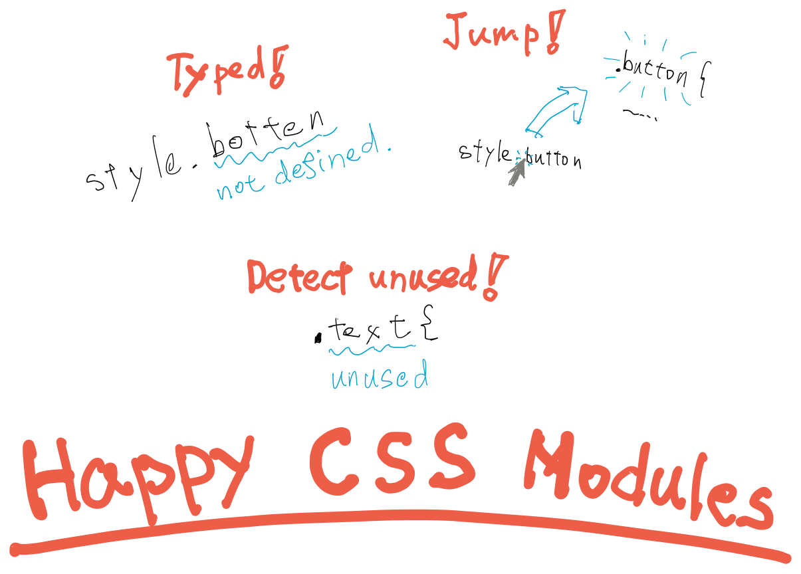

<p align="center">
  
</p>

<h2 align="center">The Collection of tools to make CSS Modules happy :)</h2>

<p align="center">
  <em>Typed, definition jumps, and unused variable detection!</em>
</p>

https://user-images.githubusercontent.com/9639995/189538880-872ad38d-2c9d-4c19-b257-521018963eec.mov

This is an experimental project aimed at PoC for https://github.com/Quramy/typed-css-modules/issues/177.

## Installation

```console
$ npm i -D happy-css-modules
```

## Usage

```console
$ hcm --help
Create .d.ts and .d.ts.map from CSS modules *.css files.

hcm [options] <glob>

Options:
      --outDir            Output directory                                                                      [string]
  -w, --watch             Watch input directory's css files or pattern                        [boolean] [default: false]
      --localsConvention  Style of exported class names. [choices: "camelCase", "camelCaseOnly", "dashes", "dashesOnly"]
      --declarationMap    Create sourcemaps for d.ts files                                     [boolean] [default: true]
      --sassLoadPaths     The option compatible with sass's `--load-path`.                                       [array]
      --silent            Silent output. Do not show "files written" messages                 [boolean] [default: false]
  -h, --help              Show help                                                                            [boolean]
  -v, --version           Show version number                                                                  [boolean]

Examples:
  hcm 'src/**/*.module.css'                            Generate .d.ts and .d.ts.map.
  hcm 'src/**/*.module.{css,scss,less}'                Also generate files for sass and less.
  hcm 'src/**/*.module.css' --watch                    Watch for changes and generate .d.ts and .d.ts.map.
  hcm 'src/**/*.module.css' --declarationMap=false     Generate .d.ts only.
  hcm 'src/**/*.module.css' --sassLoadPaths=src/style  Run with sass's --load-path.
```

## Node.js API (Experimental)

> **Warning**
> This feature is experimental and may change significantly. The API is not stable and may have breaking changes even in minor or patch version updates.

`happy-css-modules` provides Node.js API for programmatically generating .d.ts and .d.ts.map.

See [src/index.ts](https://github.com/mizdra/happy-css-modules/blob/main/src/index.ts) for available API.

### Example

With the `transformer` option, you can use AltCSS, which is not supported by `happy-css-modules`.

```javascript
// @ts-check

import { run } from 'happy-css-modules';
import { readFile } from 'fs/promises';
import { fileURLToPath, pathToFileURL } from 'url';
import sass from 'sass';

// The custom transpiler supporting sass indented syntax
/** @type {import('happy-css-modules').Transformer} */
const transformer = async (source, from) => {
  if (from.endsWith('.sass')) {
    const result = await sass.compileStringAsync(source, {
      // Use indented syntax
      // ref: https://sass-lang.com/documentation/syntax#the-indented-syntax
      syntax: 'indented',
      url: pathToFileURL(from),
      sourceMap: true,
    });
    return { css: result.css, map: result.sourceMap!, dependencies: result.loadedUrls };
  }
  return false;
};

run({
  pattern: 'src/**/*.css';
  watch: false;
  transformer,
}).catch((e) => {
  console.error(e);
  process.exit(1);
});
```

You can also create your own customized `hcm` commands. We also provide a `parseArgv` utility that parses `process.argv` and extracts options.

```javascript
#!/usr/bin/env node
// scripts/hcm.js
// @ts-check

import { run, parseArgv } from 'happy-css-modules';

// ...

run({
  ...parseArgv(process.argv), // Inherit default CLI options (e.g. --watch)
  transformer,
}).catch((e) => {
  console.error(e);
  process.exit(1);
});
```

## TODO

- [x] Add more tests
- [x] Support non-inline source maps
- [x] Implement an interface for easy use by scss/less users
- [ ] Implement stylelint rule to detect unused CSS ruleset from JavaScript
