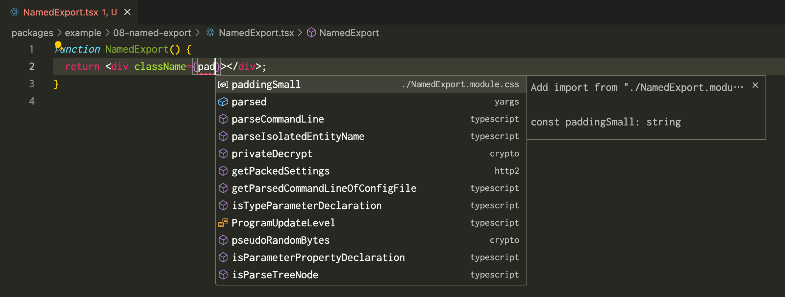

- Feature Name: Strict Type Checking
- Start Date: 2024-05-28
- RFC PR: [#259](https://github.com/mizdra/happy-css-modules/pull/259)

# Summary

This RFC proposes a strategy to support strict type checking in CSS Modules.

# Motivation

In CSS Modules, styles are written in `.module.css` files and then imported into `.js` files to use those styles. Here is an example:

```css
/* src/Counter.module.css */
.container {
  display: flex;
  justify-content: center;
  align-items: center;
}
.count {
  font-size: 24px;
}
```

```tsx
/* src/Counter.jsx */
import styles from './Counter.module.css';

function Counter({ count }) {
  return (
    <div className={styles.container}>
      <span className={styles.count}>{count}</span>
    </div>
  );
}
```

When using CSS Modules with TypeScript, a type definition file for `Counter.module.css` is needed. TypeScript will throw an error when importing a module without type information. Here is an example:

```tsx
/* types/css-modules.d.ts */
declare module '*.module.css' {
  const styles: { readonly [token: string]: string };
  export default styles;
}
```

This type definition is used in common frameworks like Next.js and Remix.

- https://github.com/vercel/next.js/blob/v14.2.3/packages/next/types/global.d.ts#L30-L33
- https://github.com/remix-run/remix/blob/remix%402.9.2/packages/remix-dev/modules.ts#L11-L14

However, this type definition cannot perform strict type checking. For example, the following code will not cause a compilation error:

```tsx
/* src/Counter.jsx */
import styles from './Counter.module.css';

function Counter({ count }) {
  return (
    <div className={styles.container}>
      <span className={styles.counter}>{count}</span>
      {/*                     ^^^^^^^
       * This is a typo. The correct is `count`.
       */}
    </div>
  );
}
```

To solve this issue, this RFC proposes a mechanism to support strict type checking in CSS Modules.

# Detailed design

This RFC proposes a CLI tool that generates type definition files for `.module.css` files. The CLI tool reads `.module.css` files and generates their type definition files. Here is an example:

<!-- prettier-ignore-start -->
```css
/* src/Counter.module.css */
.container {}
.count {}
```
<!-- prettier-ignore-end -->

<!-- prettier-ignore-start -->
```tsx
/* src/Counter.module.css.d.ts */
declare const styles:
  & { readonly container: string }
  & { readonly count: string }
;
export default styles;
```
<!-- prettier-ignore-end -->

With this type definition file, strict type checking will be enforced, and compilation errors will occur for code like the following:

```console
$ npx tsc
src/Counter.tsx:6:31 - error TS2551: Property 'counter' does not exist on type '{ readonly container: string; } & { readonly count: string; }'. Did you mean 'count'?

6       <span className={styles.counter}>{count}</span>
                                ~~~~~~~

  src/Counter.module.css.d.ts:3:16
    3   & { readonly count: string }
                     ~~~~~
    'count' is declared here.
```

## Support for `@value`

CSS Modules allows defining variables using `@value`. These variables can be used in `.js` files. Therefore, these variables should also be included in the type definition files.

Here is an example:

```css
/* src/Box.module.css */
@value paddingSmall: 8px;
@value red, blue from './colors.module.css';
.box {
  padding: paddingSmall;
}
```

```css
/* src/colors.module.css */
@value red: #ff0000;
@value blue: #0000ff;
@value green: #00ff00;
```

<!-- prettier-ignore-start -->
```tsx
/* src/Box.module.css.d.ts */
declare const styles:
  & { readonly paddingSmall: string }
  & { readonly red: string }
  & { readonly blue: string }
  & { readonly box: string }
;
export default styles;
```
<!-- prettier-ignore-end -->

## Support for `@import`

`@import` is an extension provided by css-loader and postcss-modules. It allows importing other CSS Modules files into the source file. Although not defined in the CSS Modules specification, happy-css-modules will support this feature to maintain compatibility with the ecosystem.

Here is an example:

<!-- prettier-ignore-start -->
```css
/* src/Import.module.css */
@import './common.module.css';
.basic {}
```
<!-- prettier-ignore-end -->

```css
/* src/common.module.css */
.box {
  display: flex;
  justify-content: center;
  align-items: center;
}
```

<!-- prettier-ignore-start -->
```tsx
/* src/Import.module.css.d.ts */
declare const styles:
  & import('./common.module.css').default
  & { readonly basic: string }
;
export default styles;
```
<!-- prettier-ignore-end -->

<!-- prettier-ignore-start -->
```tsx
/* src/common.module.css.d.ts */
declare const styles:
  & { readonly box: string }
;
export default styles;
```
<!-- prettier-ignore-end -->

To expand the type definitions of `common.module.css` into `Import.module.css.d.ts`, `import('./common.module.css').default` is used. This allows generating `Import.module.css.d.ts` by simply parsing `Import.module.css`. This enables the code generation tool to easily parallelize the generation of type definition files.

# Drawbacks

## Changes while editing are not reflected

The code generation tool reads `.module.css` files from the file system and generates type definition files. Therefore, if there are unsaved changes in the editor, they will not be reflected in the type definition files. This may result in outdated type errors being displayed in the editor, or type errors not being displayed where they should be. This can confuse developers.

## Type definition files can be annoying

Type definition files appear in the editor's file explorer and in the diffs of pull requests. However, developers rarely want to see type definition files. Therefore, they may find them annoying.

Changing editor or tool settings can alleviate this problem. For example, in VS Code, you can hide type definition files by adjusting the `files.exclude` or `search.exclude` settings. Adding type definition files to `.gitignore` or setting the `linguist-generated` attribute in `.gitattributes` can hide them in pull requests.

# Alternatives

## TypeScript Language Service Plugin

The TypeScript Language Service Plugin is a technology that allows customizing the behavior of the Language Server. It can be used to display type errors in the editor.

However, while the TypeScript Language Service Plugin can customize the behavior of the Language Server, it cannot customize the compilation behavior. Therefore, type errors are displayed in the editor, but the compilation succeeds. This can confuse developers.

# Prior art

- https://github.com/mrmckeb/typescript-plugin-css-modules
  - A TypeScript Language Service Plugin for type-checking CSS Modules.
- https://github.com/Quramy/typed-css-modules
  - A CLI tool for generating type definition files for `.module.css` files.
- https://github.com/skovy/typed-scss-modules
  - A CLI tool for generating type definition files for `.module.scss` files.
- https://github.com/qiniu/typed-less-modules
  - A CLI tool for generating type definition files for `.module.less` files.
- https://github.com/Viijay-Kr/react-ts-css
  - A VS Code extension for type-checking CSS Modules.

# Unresolved questions

## Should named exports be supported?

This RFC proposes generating type definition files for CSS Modules in a default export format. However, using the [`namedExport`](https://github.com/webpack-contrib/css-loader?tab=readme-ov-file#namedexport) option of css-loader, tokens can be exported from `.module.css` in a named export format. Therefore, if using this option, type definition files must also be generated in a named export format.

The generated type definition file might look like this:

<!-- prettier-ignore-start -->
```css
/* src/NamedExport.module.css */
@import './common.module.css';
@value paddingSmall: 8px;
@value red, blue from './colors.module.css';
.container {}
```
<!-- prettier-ignore-end -->

<!-- prettier-ignore-start -->
```tsx
/* src/NamedExport.module.css.d.ts */
export * from './common.module.css';
export const paddingSmall: string;
export const red: string;
export const blue: string;
export const container: string;
```
<!-- prettier-ignore-end -->

However, generating type definition files in a named export format includes _tokens_ (_tokens_ are the internal name of the item being exported) in TypeScript's completion items. In small projects, this is not an issue, but in large projects, the number of completion items can become excessive, potentially confusing developers.



Using the `typescript.preferences.autoImportFileExcludePatterns` setting in VS Code can mitigate this issue. However, this setting is only available in VS Code and not in other editors.

Therefore, in order to prioritize developer experience and editor compatibility, support for named export format type definition files will be withheld.
